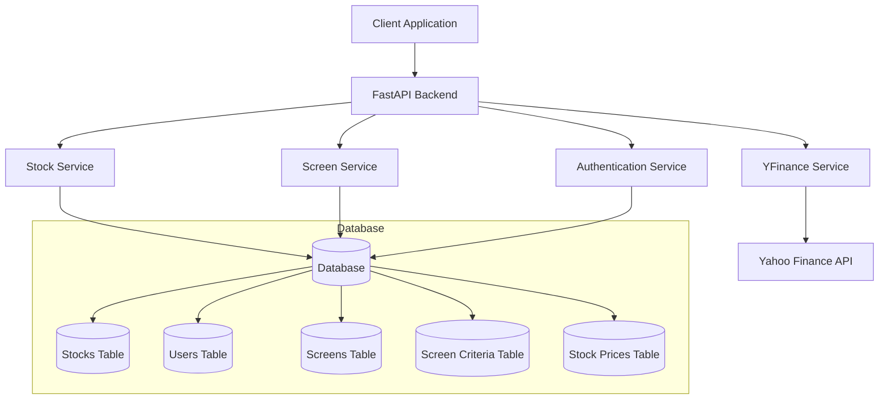

# Financial Screener Architecture

## System Overview


## Component Details

### 1. Client Application
- Frontend web application
- Communicates with backend via REST API
- Handles user authentication and session management
- Displays stock data and screening results

### 2. FastAPI Backend
- RESTful API server
- Handles HTTP requests and responses
- Implements routing and request validation
- Manages authentication and authorization
- Coordinates between different services

### 3. Services

#### Authentication Service
- Handles user registration and login
- Manages JWT tokens
- Implements password hashing and verification
- Controls access to protected endpoints

#### Stock Service
- Manages stock data
- Handles CRUD operations for stocks
- Updates stock information
- Retrieves stock details and historical data

#### Screen Service
- Manages stock screening functionality
- Creates and updates screening criteria
- Executes screens against stock data
- Returns matching stocks based on criteria

#### YFinance Service
- Interfaces with Yahoo Finance API
- Fetches real-time stock data
- Updates stock information periodically
- Handles historical price data

### 4. Database Schema

#### Users Table
```sql
CREATE TABLE users (
    id INTEGER PRIMARY KEY,
    email VARCHAR UNIQUE NOT NULL,
    password_hash VARCHAR NOT NULL,
    full_name VARCHAR NOT NULL,
    created_at TIMESTAMP DEFAULT CURRENT_TIMESTAMP
);
```

#### Stocks Table
```sql
CREATE TABLE stocks (
    id INTEGER PRIMARY KEY,
    symbol VARCHAR UNIQUE NOT NULL,
    company_name VARCHAR NOT NULL,
    sector VARCHAR,
    industry VARCHAR,
    market_cap FLOAT,
    pe_ratio FLOAT,
    price FLOAT,
    price_to_book FLOAT,
    dividend_yield FLOAT,
    eps FLOAT,
    beta FLOAT,
    fifty_two_week_high FLOAT,
    fifty_two_week_low FLOAT,
    avg_volume INTEGER,
    last_updated TIMESTAMP
);
```

#### Screens Table
```sql
CREATE TABLE screens (
    id INTEGER PRIMARY KEY,
    name VARCHAR NOT NULL,
    description VARCHAR,
    user_id INTEGER NOT NULL,
    is_public BOOLEAN DEFAULT FALSE,
    created_at TIMESTAMP DEFAULT CURRENT_TIMESTAMP,
    updated_at TIMESTAMP,
    FOREIGN KEY (user_id) REFERENCES users(id)
);
```

#### Screen Criteria Table
```sql
CREATE TABLE screen_criteria (
    id INTEGER PRIMARY KEY,
    screen_id INTEGER NOT NULL,
    field VARCHAR NOT NULL,
    operator VARCHAR NOT NULL,
    value JSON NOT NULL,
    created_at TIMESTAMP DEFAULT CURRENT_TIMESTAMP,
    updated_at TIMESTAMP,
    FOREIGN KEY (screen_id) REFERENCES screens(id)
);
```

#### Stock Prices Table
```sql
CREATE TABLE stock_prices (
    id INTEGER PRIMARY KEY,
    stock_id INTEGER NOT NULL,
    date DATE NOT NULL,
    open FLOAT,
    high FLOAT,
    low FLOAT,
    close FLOAT,
    volume INTEGER,
    created_at TIMESTAMP DEFAULT CURRENT_TIMESTAMP,
    FOREIGN KEY (stock_id) REFERENCES stocks(id)
);
```

## Data Flow

1. **User Authentication**
   ```
   Client -> API -> Auth Service -> Database
   ```

2. **Stock Data Update**
   ```
   YFinance Service -> Stock Service -> Database
   ```

3. **Screen Creation**
   ```
   Client -> API -> Screen Service -> Database
   ```

4. **Screen Execution**
   ```
   Client -> API -> Screen Service -> Database -> Stock Service -> Client
   ```

## Security Measures

1. **Authentication**
   - JWT-based authentication
   - Password hashing using bcrypt
   - Token expiration and refresh mechanism

2. **Authorization**
   - Role-based access control
   - Resource ownership validation
   - Public/private screen visibility

3. **Data Protection**
   - Input validation
   - SQL injection prevention
   - Rate limiting
   - CORS configuration

## Performance Considerations

1. **Database**
   - Indexed fields for frequent queries
   - Efficient query optimization
   - Connection pooling

2. **Caching**
   - Stock data caching
   - Screen results caching
   - API response caching

3. **API Optimization**
   - Pagination for large datasets
   - Efficient data serialization
   - Response compression

## Monitoring and Logging

1. **Application Logs**
   - Request/response logging
   - Error tracking
   - Performance metrics

2. **Database Monitoring**
   - Query performance
   - Connection pool status
   - Resource utilization

3. **API Monitoring**
   - Endpoint usage statistics
   - Response times
   - Error rates 