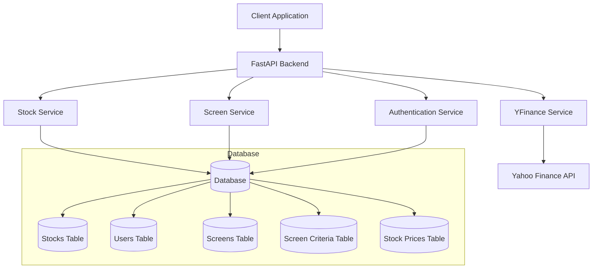
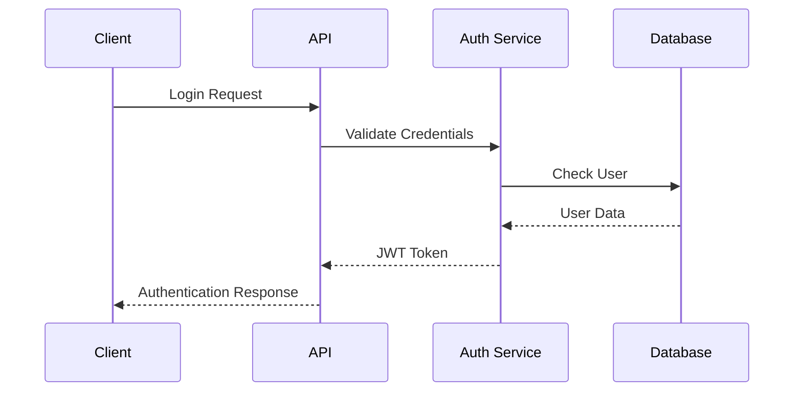
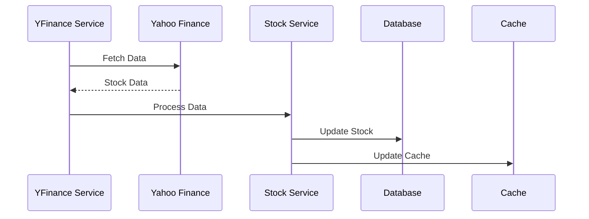
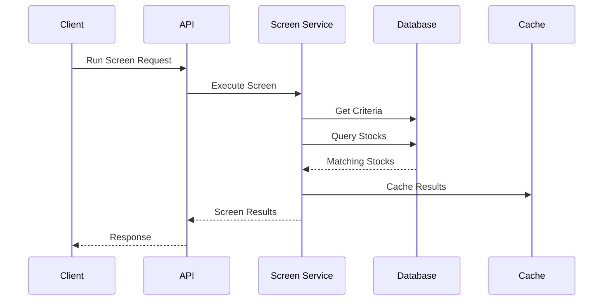

# Financial Screener System Architecture

## System Overview



## Detailed Component Architecture

### 1. Client Application Layer
- **Purpose**: User interface for interacting with the financial screener
- **Responsibilities**:
  - User authentication and session management
  - Display and interaction with stock data
  - Screen creation and management
  - Results visualization
- **Key Features**:
  - Real-time data updates
  - Interactive charts and graphs
  - Responsive design
  - Error handling and user feedback

### 2. API Layer (FastAPI Backend)

#### 2.1 API Gateway
- **Purpose**: Entry point for all client requests
- **Responsibilities**:
  - Request routing
  - Authentication middleware
  - Rate limiting
  - Request validation
  - Response formatting
- **Key Features**:
  - OpenAPI/Swagger documentation
  - Request/response logging
  - Error handling
  - CORS configuration

#### 2.2 Authentication Service
- **Purpose**: Handle user authentication and authorization
- **Components**:
  - User registration
  - Login/logout
  - Token management
  - Password hashing
- **Security Features**:
  - JWT token-based authentication
  - Password hashing with bcrypt
  - Token expiration and refresh
  - Rate limiting for auth endpoints

#### 2.3 Stock Service
- **Purpose**: Manage stock data and operations
- **Components**:
  - Stock CRUD operations
  - Price history management
  - Data validation
  - Cache management
- **Key Features**:
  - Real-time data updates
  - Historical data management
  - Data validation and sanitization
  - Caching strategy

#### 2.4 Screen Service
- **Purpose**: Handle stock screening operations
- **Components**:
  - Screen creation and management
  - Criteria validation
  - Screen execution
  - Results processing
- **Key Features**:
  - Dynamic query building
  - Criteria validation
  - Performance optimization
  - Result caching

#### 2.5 YFinance Service
- **Purpose**: Interface with Yahoo Finance API
- **Components**:
  - Data fetching
  - Rate limiting
  - Error handling
  - Data transformation
- **Key Features**:
  - Real-time data fetching
  - Historical data retrieval
  - Error handling and retries
  - Data normalization

### 3. Database Layer

#### 3.1 Database Schema

##### Users Table
```sql
CREATE TABLE users (
    id INTEGER PRIMARY KEY,
    email VARCHAR UNIQUE NOT NULL,
    password_hash VARCHAR NOT NULL,
    full_name VARCHAR NOT NULL,
    created_at TIMESTAMP DEFAULT CURRENT_TIMESTAMP,
    updated_at TIMESTAMP,
    last_login TIMESTAMP
);
```

##### Stocks Table
```sql
CREATE TABLE stocks (
    id INTEGER PRIMARY KEY,
    symbol VARCHAR UNIQUE NOT NULL,
    company_name VARCHAR NOT NULL,
    sector VARCHAR,
    industry VARCHAR,
    market_cap FLOAT,
    pe_ratio FLOAT,
    price FLOAT,
    price_to_book FLOAT,
    dividend_yield FLOAT,
    eps FLOAT,
    beta FLOAT,
    fifty_two_week_high FLOAT,
    fifty_two_week_low FLOAT,
    avg_volume INTEGER,
    last_updated TIMESTAMP,
    created_at TIMESTAMP DEFAULT CURRENT_TIMESTAMP,
    updated_at TIMESTAMP
);
```

##### Screens Table
```sql
CREATE TABLE screens (
    id INTEGER PRIMARY KEY,
    name VARCHAR NOT NULL,
    description VARCHAR,
    user_id INTEGER NOT NULL,
    is_public BOOLEAN DEFAULT FALSE,
    created_at TIMESTAMP DEFAULT CURRENT_TIMESTAMP,
    updated_at TIMESTAMP,
    last_run_at TIMESTAMP,
    FOREIGN KEY (user_id) REFERENCES users(id)
);
```

##### Screen Criteria Table
```sql
CREATE TABLE screen_criteria (
    id INTEGER PRIMARY KEY,
    screen_id INTEGER NOT NULL,
    field VARCHAR NOT NULL,
    operator VARCHAR NOT NULL,
    value JSON NOT NULL,
    created_at TIMESTAMP DEFAULT CURRENT_TIMESTAMP,
    updated_at TIMESTAMP,
    FOREIGN KEY (screen_id) REFERENCES screens(id)
);
```

##### Stock Prices Table
```sql
CREATE TABLE stock_prices (
    id INTEGER PRIMARY KEY,
    stock_id INTEGER NOT NULL,
    date DATE NOT NULL,
    open FLOAT,
    high FLOAT,
    low FLOAT,
    close FLOAT,
    volume INTEGER,
    created_at TIMESTAMP DEFAULT CURRENT_TIMESTAMP,
    FOREIGN KEY (stock_id) REFERENCES stocks(id)
);
```

#### 3.2 Database Indexes
```sql
-- Users table indexes
CREATE INDEX idx_users_email ON users(email);

-- Stocks table indexes
CREATE INDEX idx_stocks_symbol ON stocks(symbol);
CREATE INDEX idx_stocks_sector ON stocks(sector);
CREATE INDEX idx_stocks_industry ON stocks(industry);

-- Screens table indexes
CREATE INDEX idx_screens_user_id ON screens(user_id);
CREATE INDEX idx_screens_is_public ON screens(is_public);

-- Screen criteria table indexes
CREATE INDEX idx_screen_criteria_screen_id ON screen_criteria(screen_id);
CREATE INDEX idx_screen_criteria_field ON screen_criteria(field);

-- Stock prices table indexes
CREATE INDEX idx_stock_prices_stock_id ON stock_prices(stock_id);
CREATE INDEX idx_stock_prices_date ON stock_prices(date);
```

### 4. Data Flow Patterns

#### 4.1 User Authentication Flow


#### 4.2 Stock Data Update Flow


#### 4.3 Screen Execution Flow


### 5. Security Architecture

#### 5.1 Authentication
- JWT-based authentication
- Token expiration and refresh mechanism
- Password hashing with bcrypt
- Rate limiting for auth endpoints

#### 5.2 Authorization
- Role-based access control
- Resource ownership validation
- Public/private screen visibility
- API key management

#### 5.3 Data Protection
- Input validation and sanitization
- SQL injection prevention
- XSS protection
- CSRF protection
- Rate limiting
- CORS configuration

### 6. Performance Optimization

#### 6.1 Database Optimization
- Indexed fields for frequent queries
- Query optimization
- Connection pooling
- Efficient data types

#### 6.2 Caching Strategy
- Redis for caching
- Cache invalidation strategy
- Cache warming
- Cache size management

#### 6.3 API Optimization
- Response compression
- Pagination
- Efficient serialization
- Request batching

### 7. Monitoring and Logging

#### 7.1 Application Monitoring
- Request/response logging
- Error tracking
- Performance metrics
- Resource utilization

#### 7.2 Database Monitoring
- Query performance
- Connection pool status
- Resource utilization
- Slow query logging

#### 7.3 API Monitoring
- Endpoint usage statistics
- Response times
- Error rates
- Rate limit tracking

### 8. Error Handling

#### 8.1 Error Types
- Validation errors
- Authentication errors
- Authorization errors
- Business logic errors
- System errors

#### 8.2 Error Response Format
```json
{
    "error": {
        "code": "ERROR_CODE",
        "message": "Human readable message",
        "details": {
            "field": "Additional error details"
        }
    }
}
```

### 9. Deployment Architecture

#### 9.1 Development Environment
- Local development setup
- Docker containers
- Development database
- Mock services

#### 9.2 Production Environment
- Load balancer
- Multiple application servers
- Database replication
- Cache cluster
- Monitoring stack

### 10. Future Considerations

#### 10.1 Scalability
- Horizontal scaling
- Database sharding
- Cache distribution
- Load balancing

#### 10.2 Feature Roadmap
- Real-time notifications
- Advanced screening criteria
- Machine learning integration
- Mobile application
- API versioning 